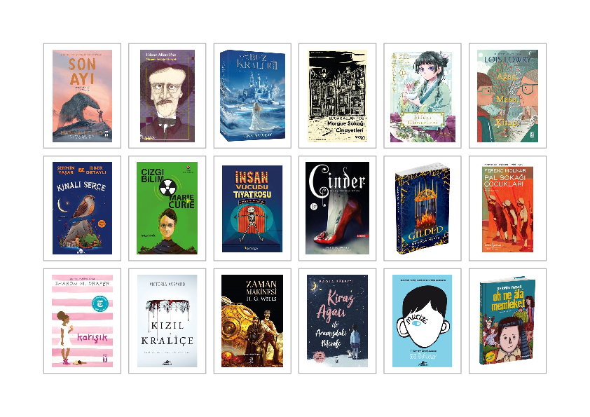

# D&R Kitap Kapakları

Gemini ile yazdırılmış "vibe coded" bir mini program. D&R linklerinden veya ürün kodlarından kitap kapaklarını çekip
ızgara formatında A4 PDF albümü oluşturan bir araç.

### Neye Benziyor?

[Örnek girdi](./sample.txt) dosyasıyla üretilen [örnek çıktı](./sample.pdf) için resme tıklayın.

[](./sample.pdf)

### Nasıl Çalışıyor?

Herhangi bir harici font veya map dosyası gerektirmiyor, direkt veya ilgili işletim sistemi için (Go'nun harika çapraz
platform desteği sayesinde) önceden derleyerek çalıştırabilirsiniz.

```bash
# Dosya vererek (Çıktı: kitaplar.pdf)
go run . kitaplar.txt

# Veya standart girdiden (Çıktı: output.pdf)
go run .

# Öntanımlı 3x6 boyutu yerine 4x8 ızgara kullan
go run . -size 4x8 kitaplar.txt
```

### SSS

- Neden böyle bir şey?

  Kızımın kitap okuma günlüğüne yapıştırdığı küçük kitap kapağı resimlerine olan acil ihtiyaç üzerine...

- Neden D&R?

  Kapak resimleri (alternatiflerine göre) bir parça daha yüksek çözünürlükte.

- Program çalışmıyor?

  Bilemiyorum. D&R link formatını değiştirmiş olabilir.
